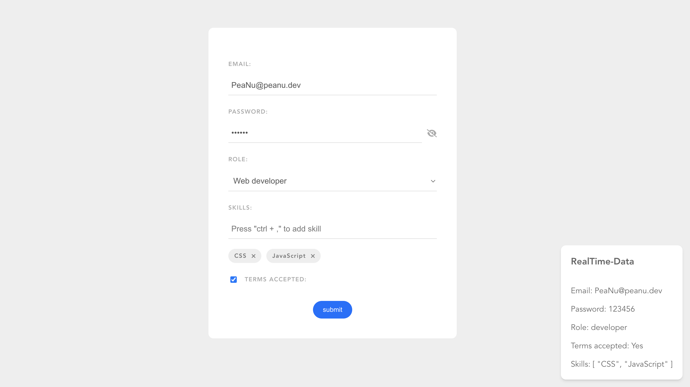

# Vue－表單練習

來自 [Build Web Apps with Vue JS 3 & Firebase](https://www.udemy.com/course/build-web-apps-with-vuejs-firebase/) 的其中一項專案。

這份專案是用來練習 Vue 的基本表單操作，包含：

- `v-model` 的使用（Input、Select、Checkbox）
- `modifier` 的使用（prevent、ctrl）
- 表單驗證（密碼長度）

總之只是份簡單的練習，不過表單確實是常會遇到的需求，所以才留個紀錄。

網站連結：https://jubeatt.github.io/Vue-Web-Form

附註：左下角是 `data` 的即時資料，這樣會更好理解什麼是「雙向綁定」
